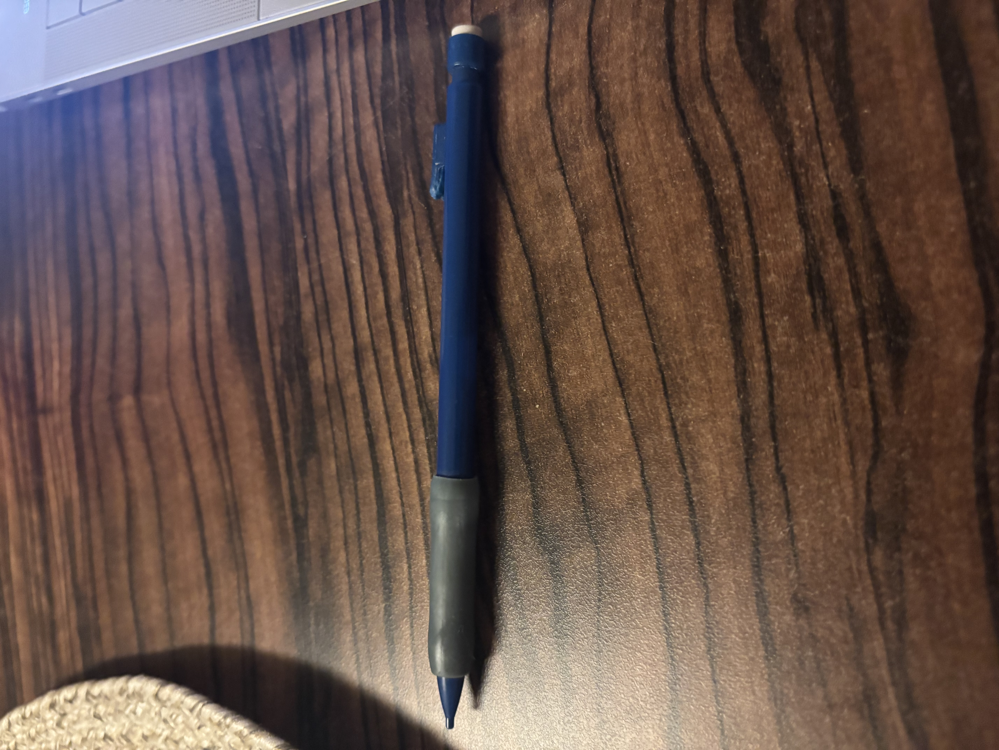

# A1 – Building Portfolio

## Analyze
## Task A:  Portfolio Analysis 
Portfolio analysis on NateKarau61. This portfolio is set up very well and can be navigated with ease allowing the reader to find what they need in seconds by using links and different project folders. The projects in the portfolio are all given with pictures and engineering drawings with dimensions so that anyone can replicate the work shown. This portfolio only shows the finished product of projects as a way of presentation and does not show any steps in the building or design process. The language used on this portfolio would meet the standards of a document that an employer would use.

Portfolio analysis on Katie Heinmann. This portfolio is organized very well by spacing out and listing information and projects in an orderly fashion and giving descriptions of each area. There is a lot of information on this portfolio making it harder to navigate in a short amount of time and find specific information. This portfolio has in depth documentation on the work that they have done allowing any reader or colleague to take the information and replicate the work without any further questions. This portfolio shows their decision-making process and the trail and setbacks that they had to get over to the final product. The documentation of this portfolio would meet all professional standards that an employer would want by the language and layout of the portfolio.  

## Task B:  Product Analysis
product analysis-Mechanical pencil
a. The primary function of a mechanical pencil is to use a input force from someone to the use of the graphite in the pencil. Mechanically it uses transmission and displacement through the use of a clutch mechanism that will release lead when the user applies force.

## Decide
1. Homepage identity- The purpose of the homepage of my portfolio is to set a professional tone to the reader and to not come off as a project display page. The reader should know by reading the homepage what MEGR 2156 is and the focus of the class to understand what is being displayed. The homepage should also show the standard that my portfolio should be held to, and I want that to be clearly known to the reader as the look my homepage. The home page should also not be overwhelming for the reader to understand and be easily maneuverable to a new viewer.
2. Initial customization- The customization that I decided to change was changing the section label from 2157 to MEGR 2156 because that is the actual class section that I am in. I also used the change to help explain what exactly MEGR 2156 is and what the reader should expect.
3. Documentation standards- All of the assignments that I summit and my portfolio as a whole should clearly explain the assignment in a way that anyone no matter what their background can understand what is being presented or explained. 

## Communicate
Most of the communicate part of this assignment can be found in the about me section of my portfolio this will have my professional introduction.

"What does it mean to defend an engineering decision : and do you currently know how to do it? 
To defend an engineering decision is to be able explain and stand by the decision that you made. It means that the knowledge to know why the decision was made or how u got to a certain point. It forces you to be able to communicate and articulate research and information that help justify the decision you made. I do not think that I currently know how to properly defend my decision.
