# A2 – Truss Stress Analysis
For this assignment, I have to design a 3D truss system based of this image.
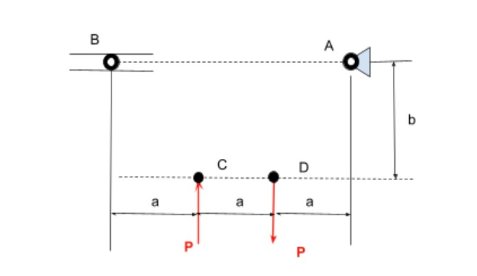

The Distance of a is .4 meters, the distance of b is .3 meters, and the force of P is 20 kN. The point B is a roller, and the point A is a pin. The pin A also has a fixed position on the wall. The truss system also must be made from a A500 structural steel. To start the design process, I looked at the external force that would be acting on the system. I then decided to design my truss system. I made a connection between all of the points and the made a triangle connection on the middle to provide extra support.

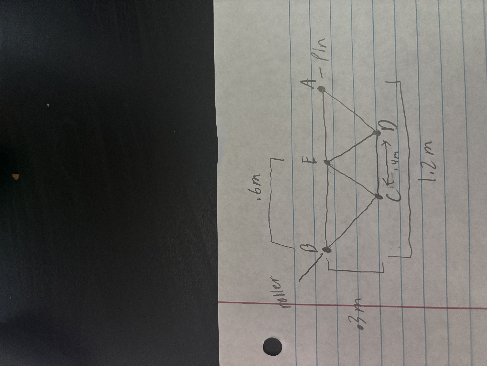
For my truss system I went for a simple design that created more in the middle of the system to provide more support structure for the system. I connected two beams in the middle to prove that extra stability for the system. These beams run from C and D and connect to a new joint at E.

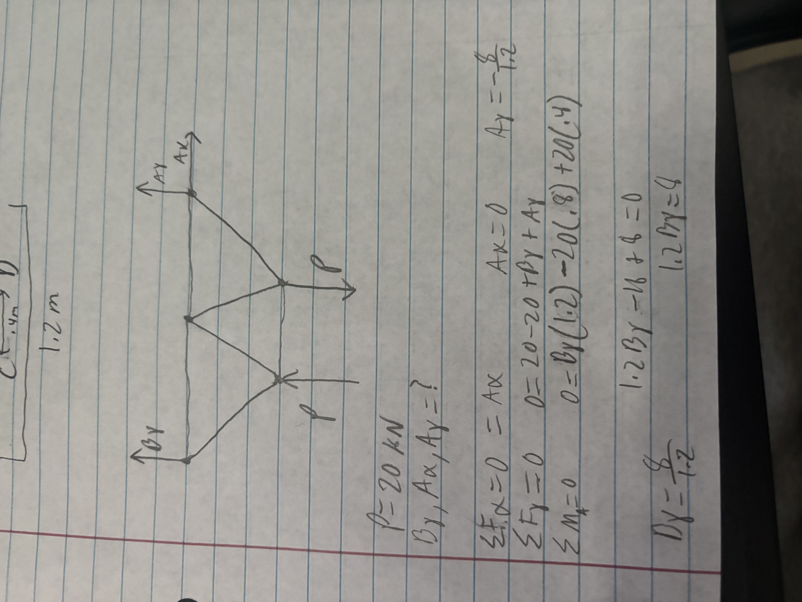

Now I started to solve the external forces on the truss system. I stated with the forces in the x direction with no other forces other that Ax the force was 0. Then I solved for the moment of the A pin so that I could get the unknown By. Then finally I used all of the components to solve for the sum of force in the Y direction giving me the last unknown of Ay.
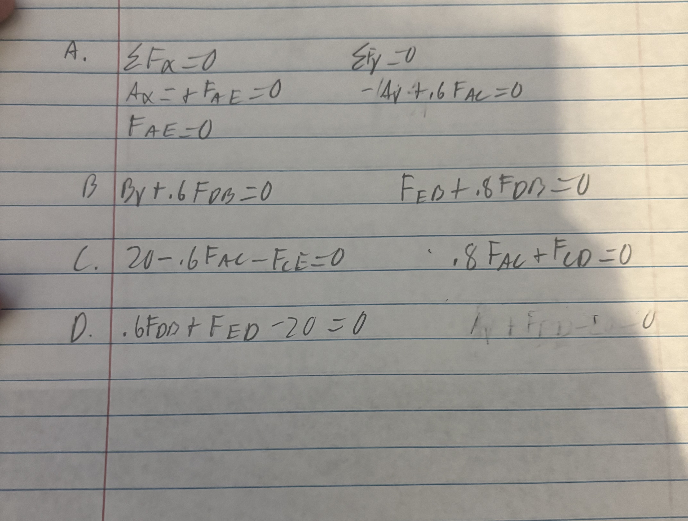
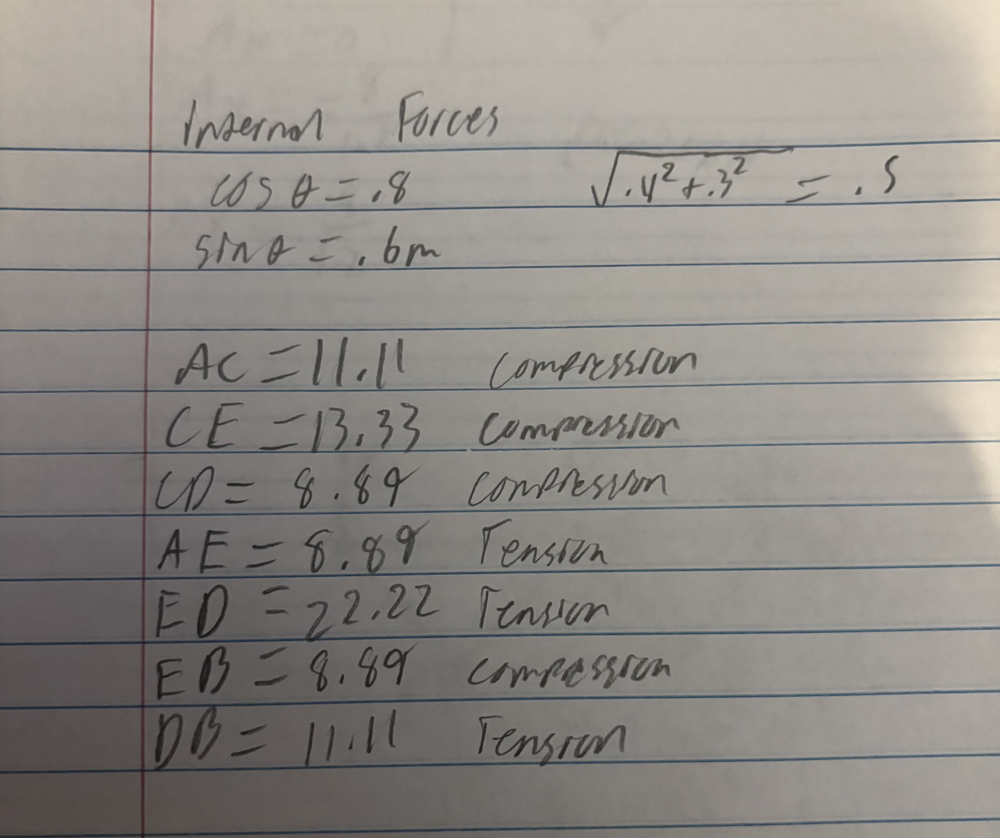
I then solved for the internal stress in the truss system. The first picture is of the equations and format that I used to get the internal force of each bar. The second picture is the numerical values of each bar and weather they were in compression or tension.
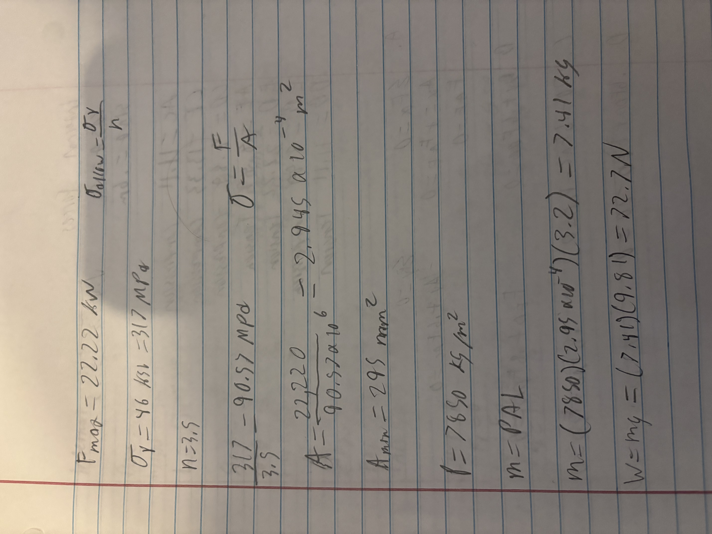
I used the normal stress equation to solve for the cross-sectional area of the truss. I plugged in the strength of A500 steel and the max force to find the cross-sectional area. I then time the area by 3.5 as the safety factor. I then used this number to solve for both the mass and the weight of the truss.

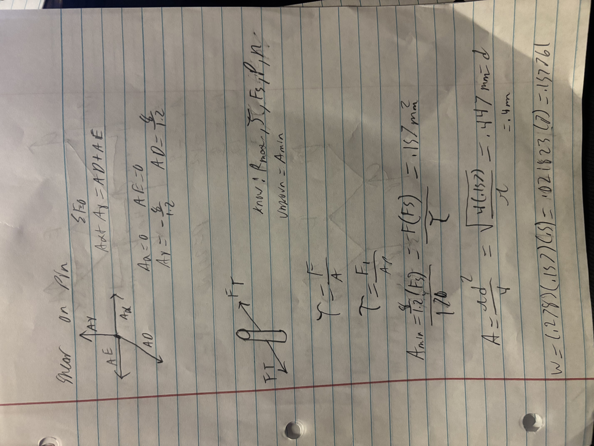

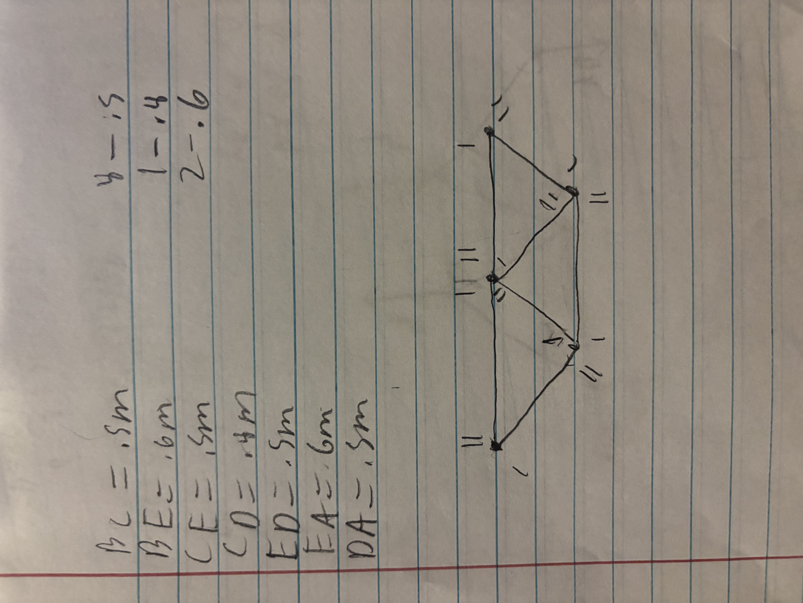

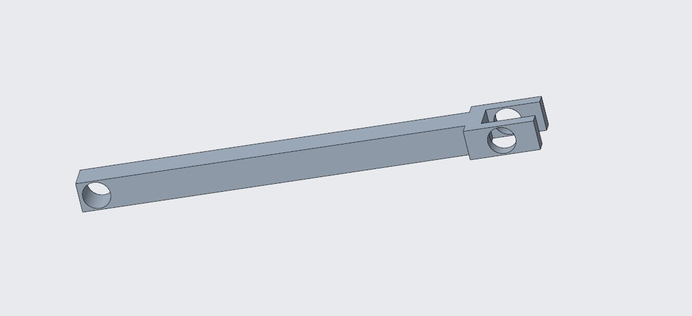

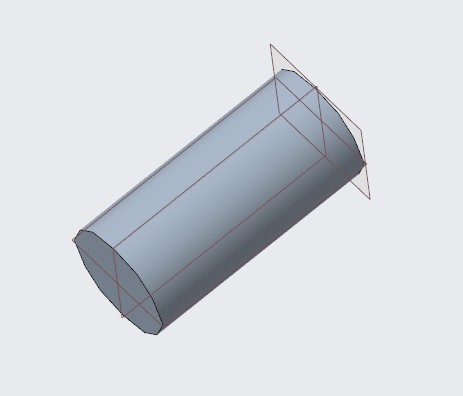

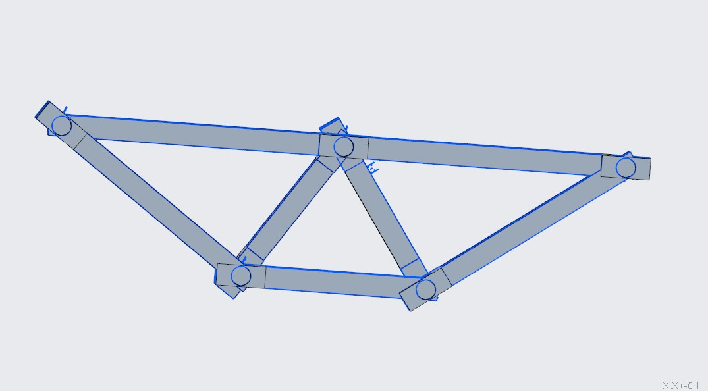

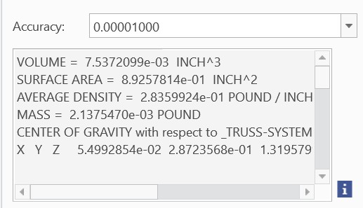

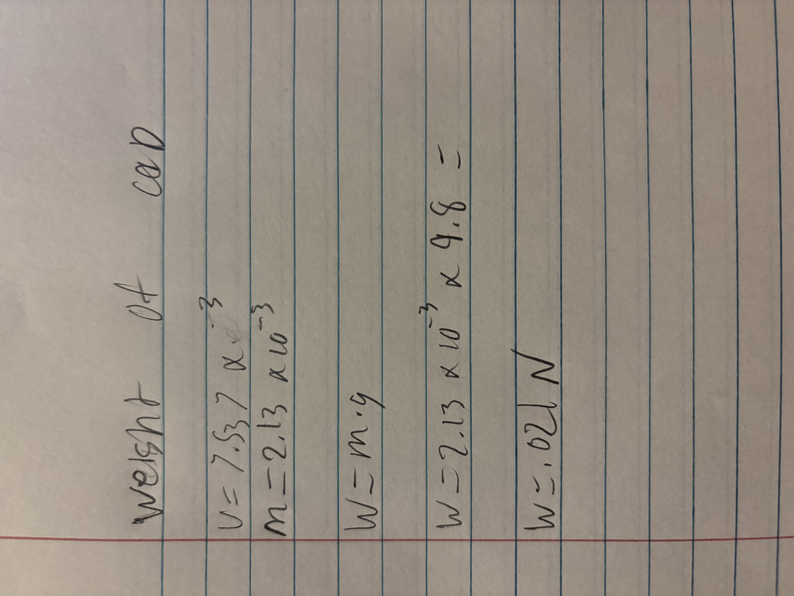

## Objective 

## Analyze

## Decide
_Which geometry did you select, and why? This is your first open design choice in the course — defend it._

## Communicate

