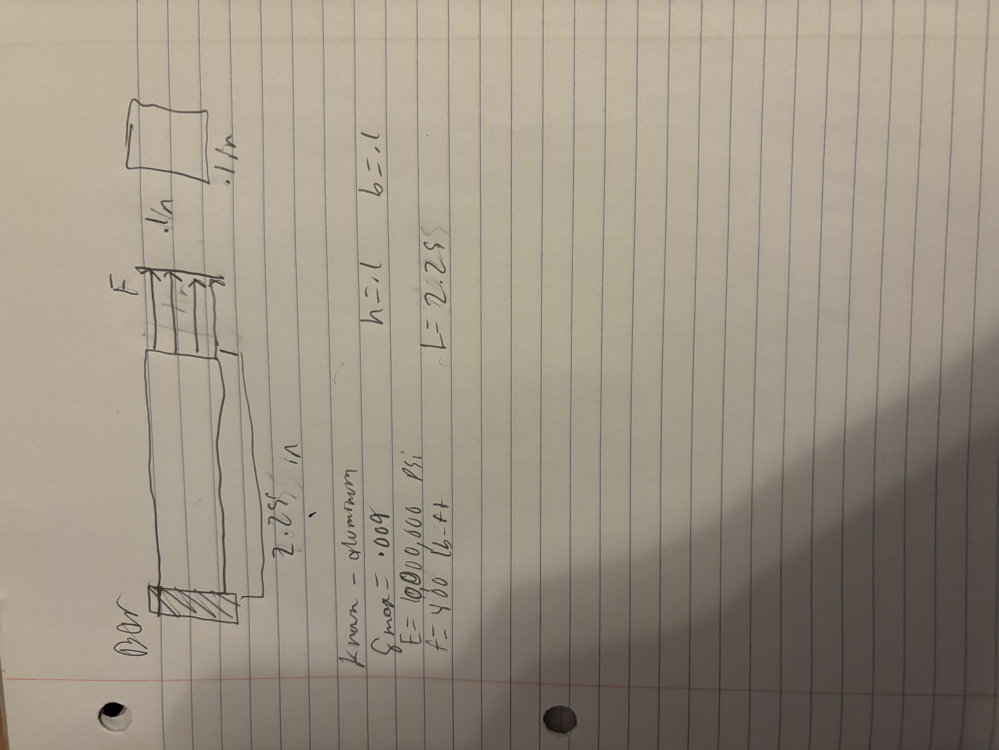
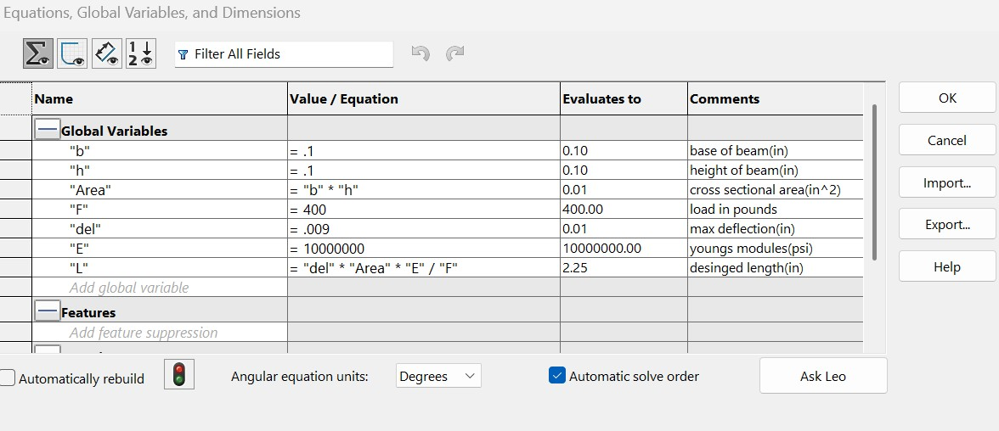
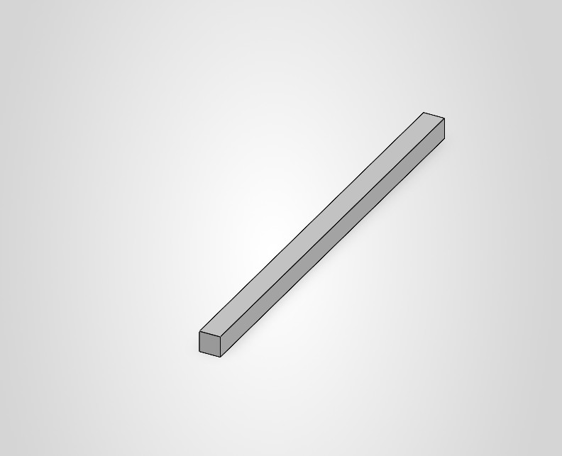
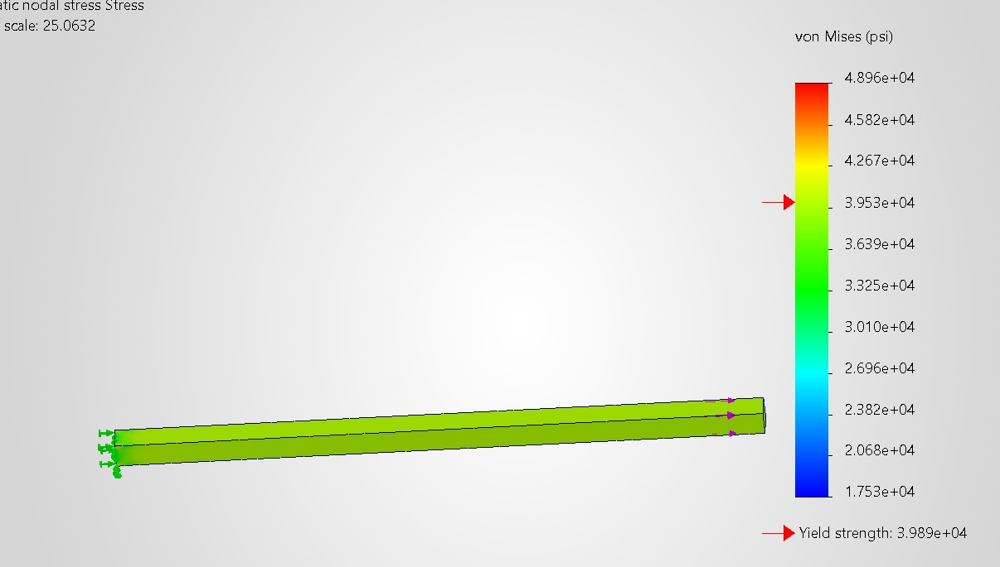
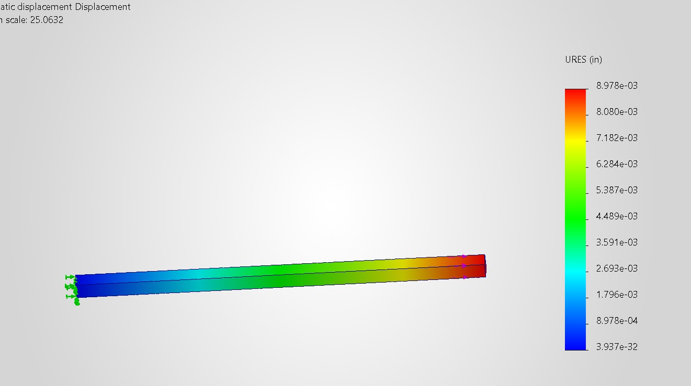

# A3 – [Parametric and FEA]

# parametric design
The parametric bar I designed has a max axial deflection of .009 inches. The bar is made out of aluminum and has a young's modulus of 10,000,000 psi. The base and height of the bar are both .1 in. The bar will also have a direct load of 400 foot-pounds applied to it on the opposite side of the bar from its fixed position. using the equation from the book I get a length of the bar at 2.25 in. For the material of the aluminum I selected 6061-T6(ss) Aluminum. The safety factor was 1 for the CAD model.

Here is an image of the Cad calculations and fomulas that the CAD system used to produce the length for the model. 

Here is an image of the beam after imputing the numbers from the calculations that the cad system gave me.

This is an image of the stress that it exerted onto the beam. A chart of the about of stress is also included in the image.

This is an image of how much displcament the beam underwnt becuse of the force. It also has a chart displaing its diplment number.

The max displacement I got from the CAD system was .008978 in and the max from hand was supposed to be .009 in, so the percent difference is .24%. It makes sense that the numbers are so close because the calculations are almost the exact same. I would trust the computers number more than mine because it takes in exact numbers and not just whole numbers into account when calculating the force. 

The Bar would not make the safety reequipments because it has 1 safety factor and the whole would make it lower than the required amount.

During this assignment I learned how to run simulations in SolidWorks. I had a difficult time getting the simulation to work proper and get the units right but by the end it all worked out. This assignment took me around 3-4 hours to complete.
