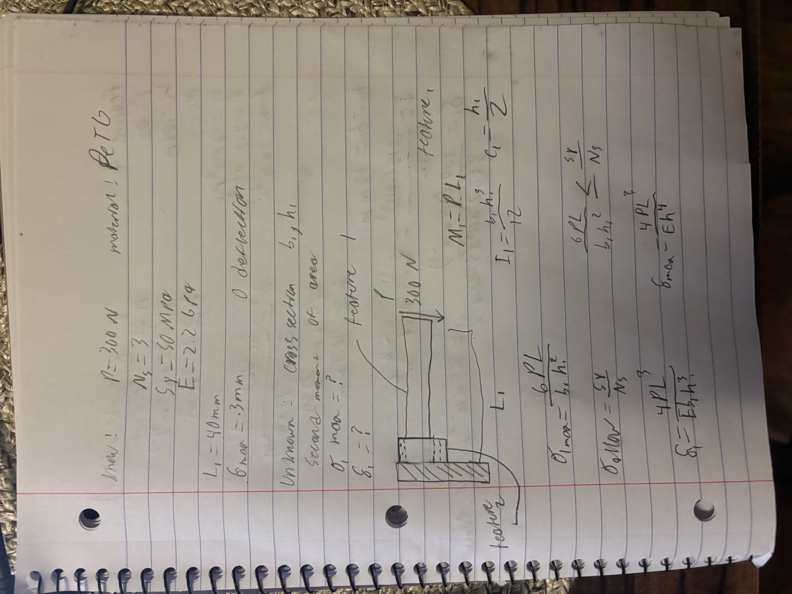
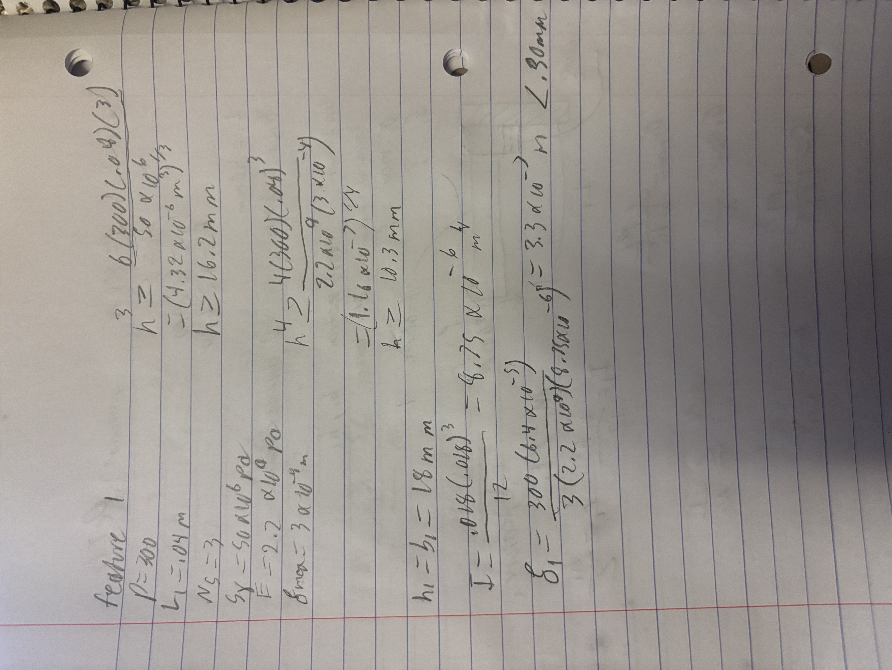
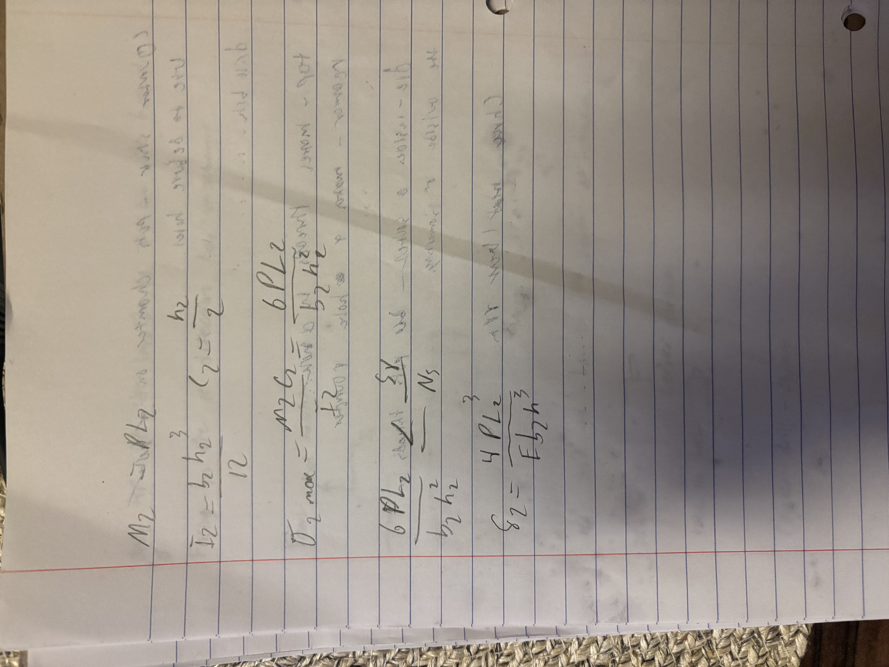
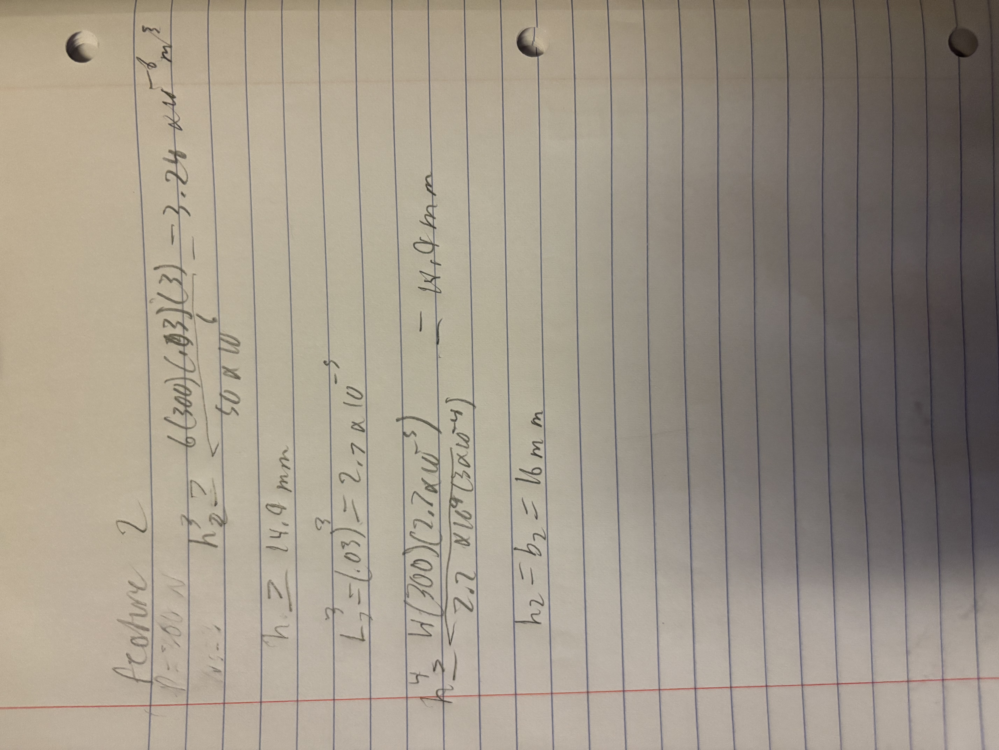
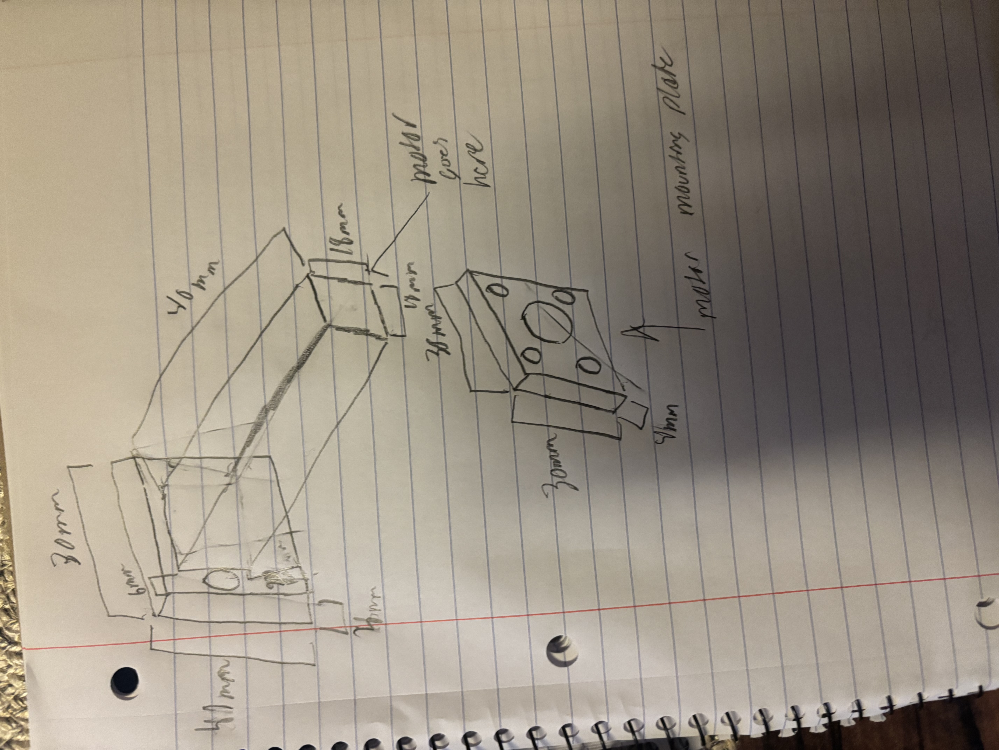
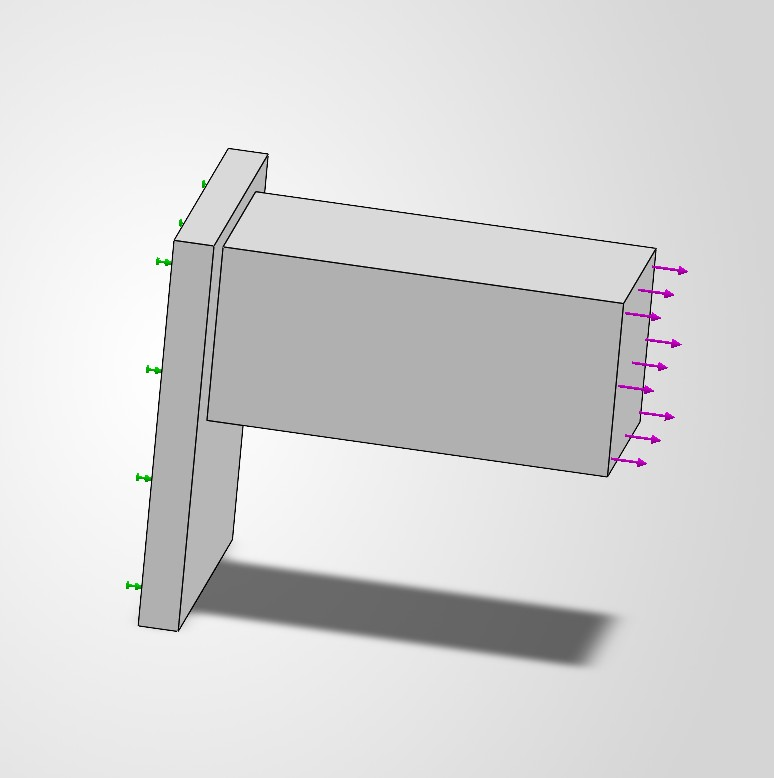
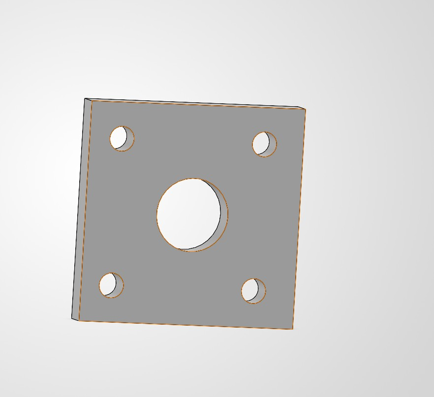
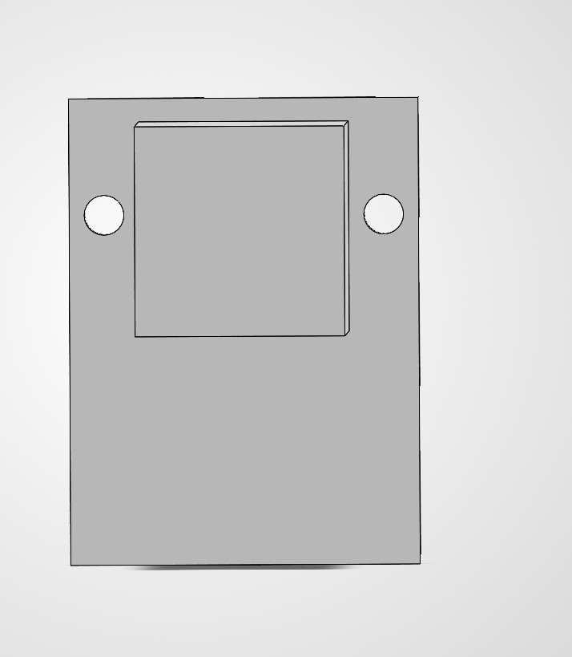
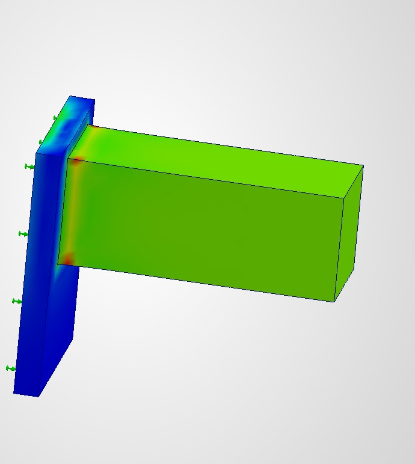

# A4 – [Motor mount]

## Feature 1
In this section I went over all of the unknowns and knowns I also chose PET as my material. I then drew a free body diagram of the two features for the motor mount. after that I did the symbolic equations for the first feature. I then used those equations by plugging in numbers to get the base and height of each part to make sure they stay in the parameters.

This image is of the Freebody diagram and knowns and unknowns and also the symbolic equations for feaure 1.

This is an image of numerical values from the equations above.

## Feature 2

This is a picture of the symbolic calculations and equations for feature 2.

These are the numerical values from the equations above.

## Sketch

This is a hand drawn sketch of what the cad model should look like and the diminsions of each part.
## CAD Model
This section is all of the cad models, files and there evalutations and stress.

this is an image of the wall mount with fixed end and the force acting on it.

This is an image of the motor plate which will be installed on the other end of the motor.

This is the cad model of the wall mount with holes for screws or pins to be installed into a wall.

this is an image of the stress simulation that the wall mount will feel with the wall mount installed on it.

CAD model links-  [[[https://raw.githubusercontent.com/<username>/<repository>/<branch>/<file_path>](https://github.com/Gavin-Anderson-ME/-megr2157-portfolio/blob/main/docs/assignments/A04/motorplate.SLDPRT)]]

[https://raw.githubusercontent.com/<username>/<repository>/<branch>/<file_path](https://github.com/Gavin-Anderson-ME/-megr2157-portfolio/blob/main/docs/assignments/A04/wallmount.SLDPRT)>

