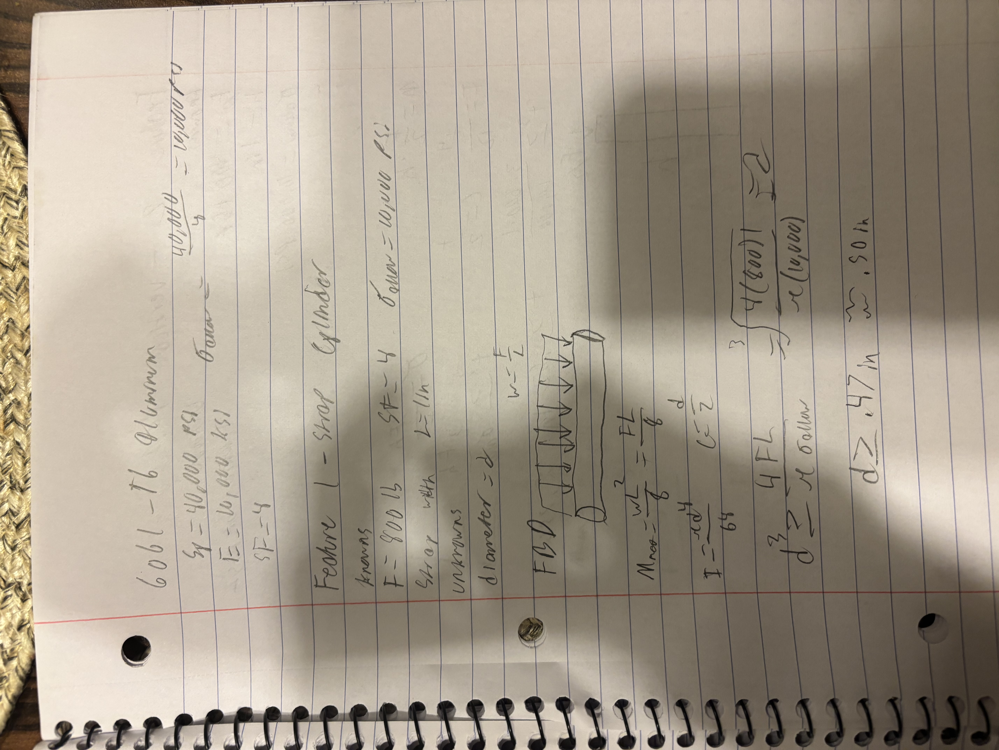
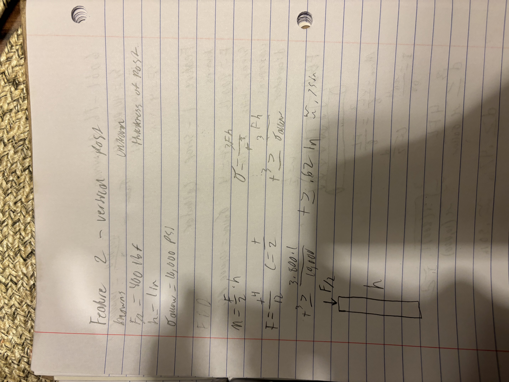
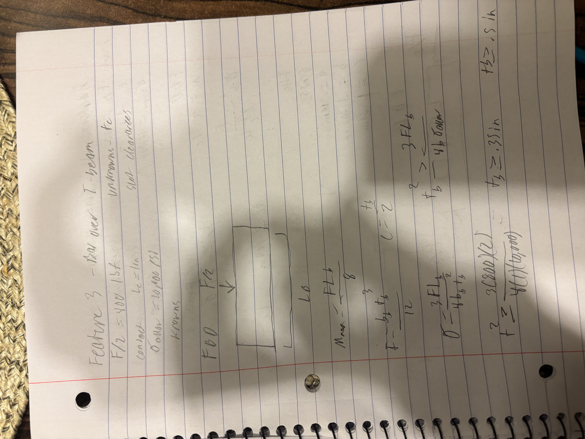
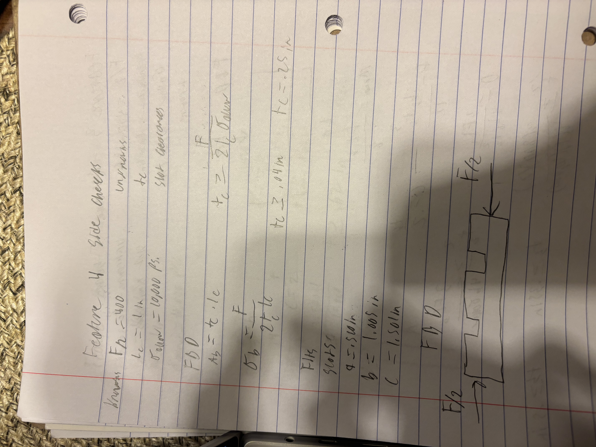
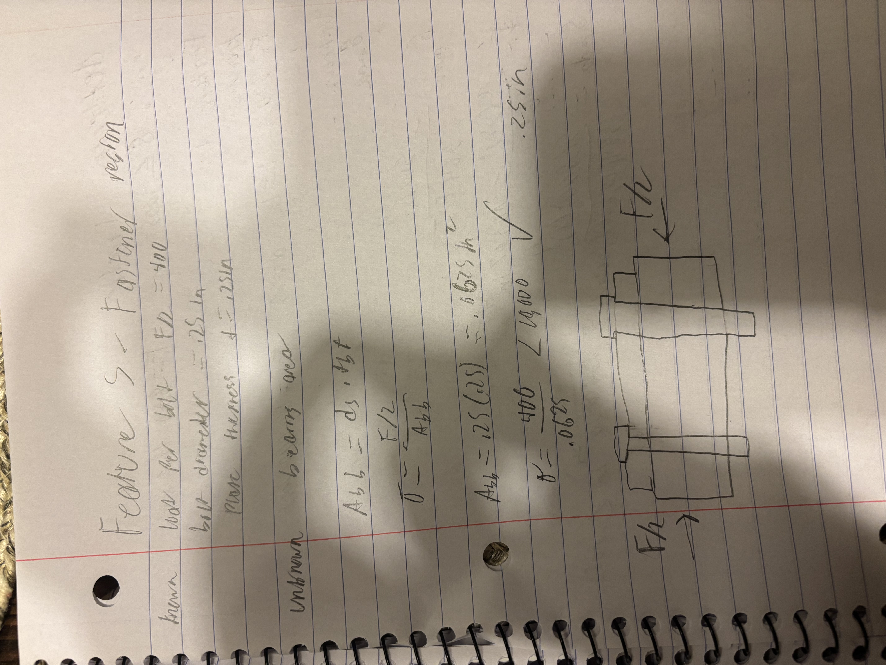
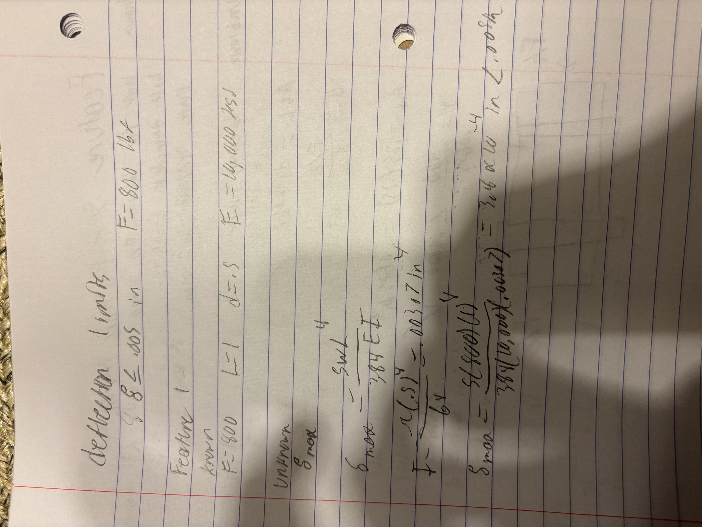
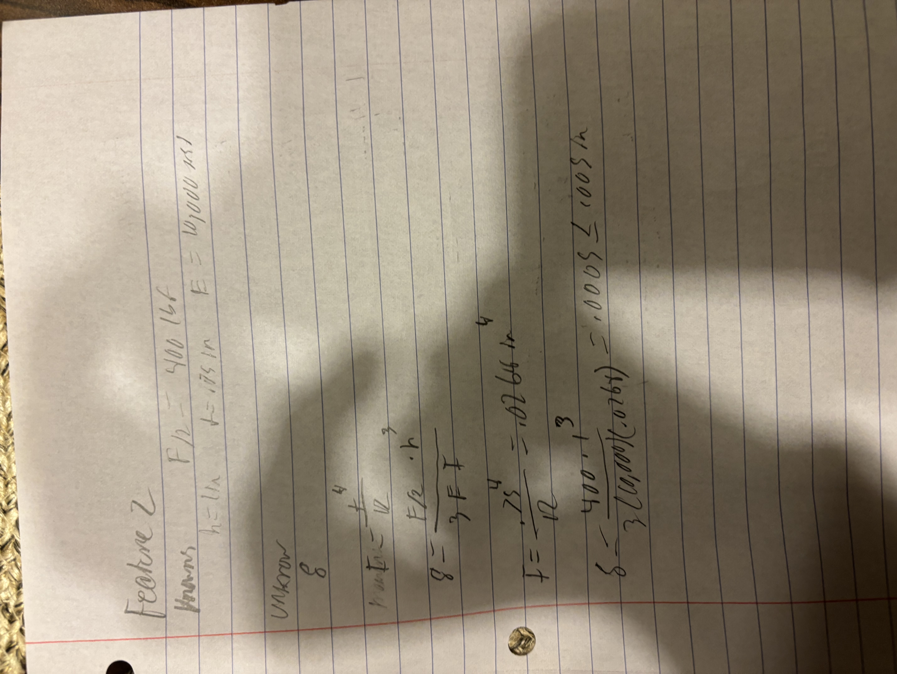
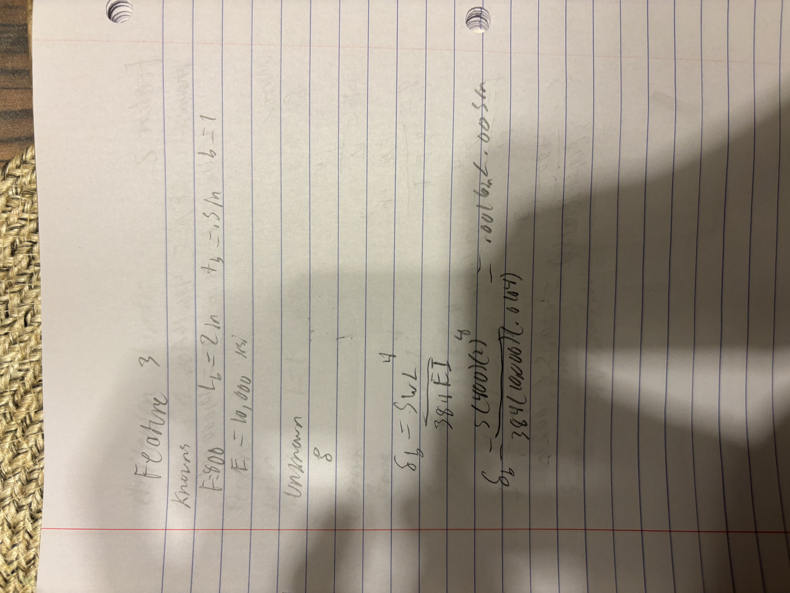
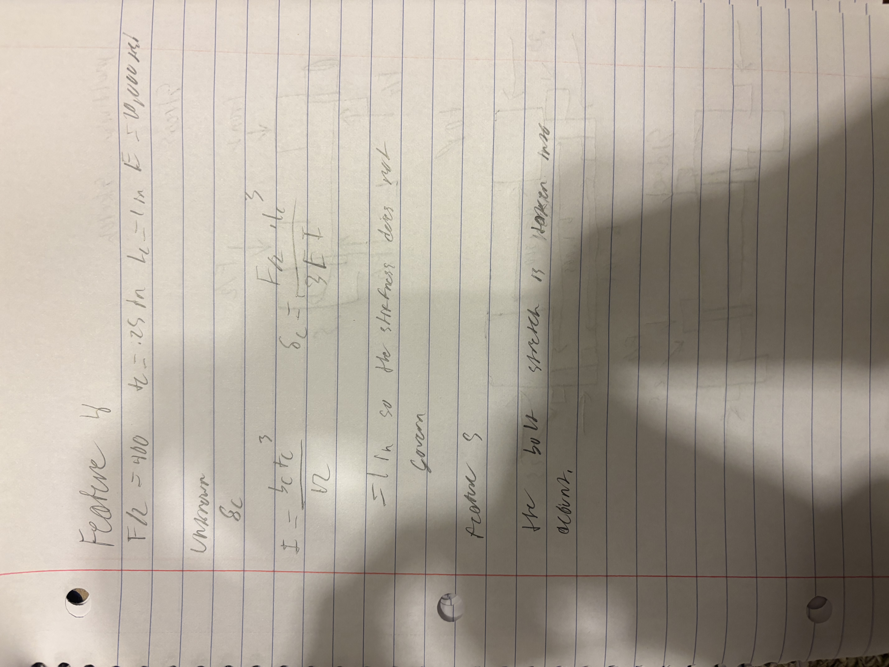
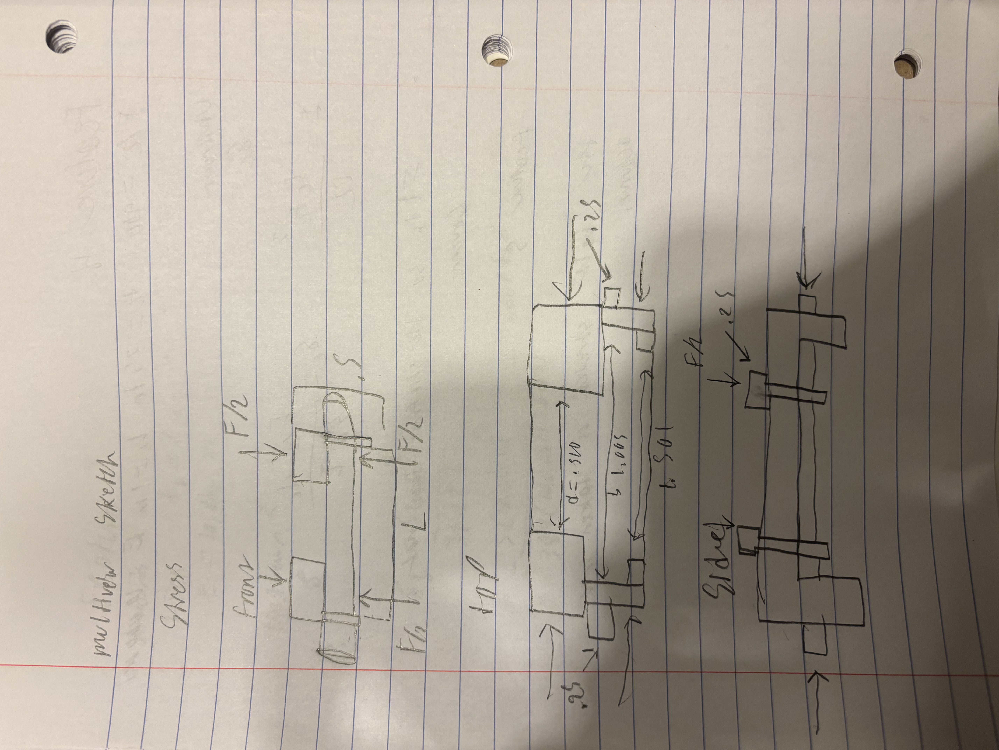

# A5 – [Bracket design]

## stress analysis

these are all of my stress analysis and assumptions.

assumption 1- The cylinder will act like a support beam.

assumption 2- most of the stress that this part undergoes should be bending stress

assumption 3- will act as a support on each end of the bar.

assumption 4- will transfer load that it puts onto the T beam.

assumption 5- the bolts will be safe from both shear and tension.

## stiffness analysis
these are all my stiffness analysis and assumptions.

assumption 1- will support the beam with a uniform load.

assumption 2- it will have an end load

assumption 3- will act as a support beam and provide a uniform load.

assumption 4- should only undergo plate bending.

## sketch

## lesson learned

governing failure mode- the greatest stress is .62 in and the greatest stiffness is .40 in so a good choice for governed stress is .75in

error propagation -if you solved with the smaller about of force you would get a smaller diameter and if you applied the higher force load to it would fail the stress test.

assumption sensitivity- the load is uniformly distributed across the cylinder. if this is not true then the diameter would have to increase because it would not be able to support the load.

