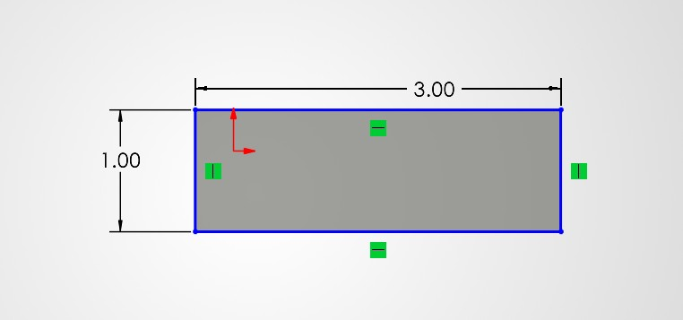
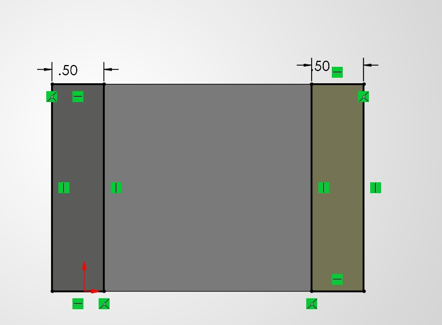
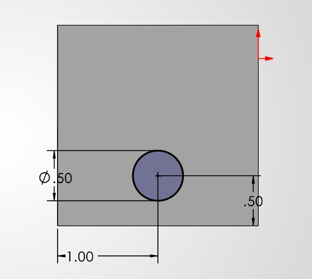
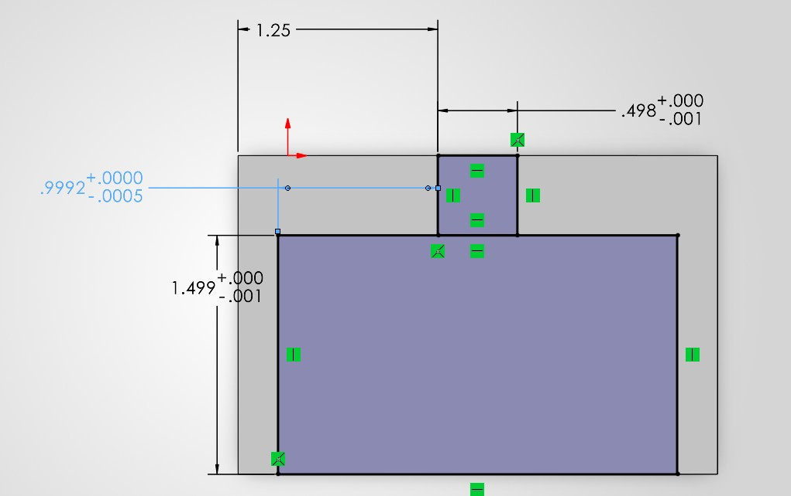
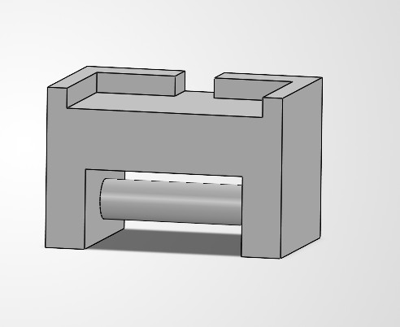
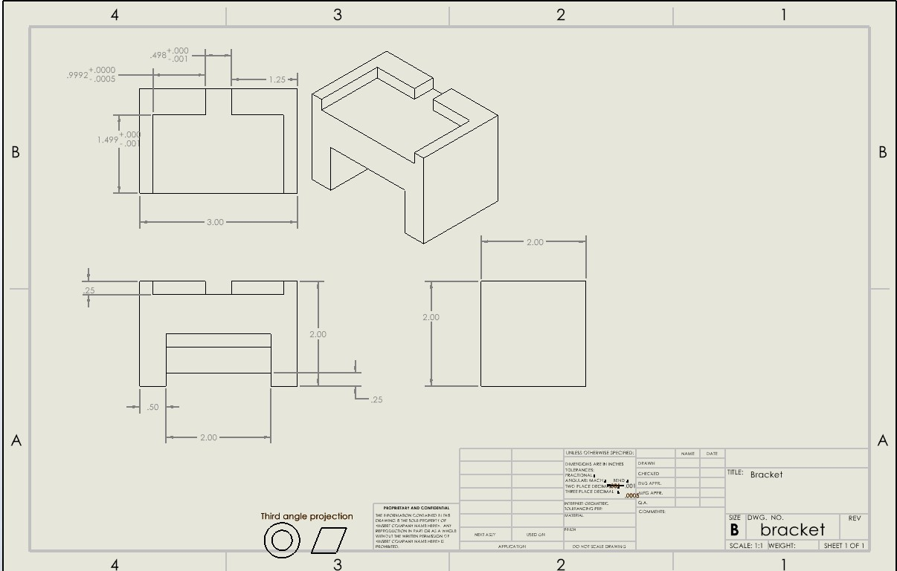

# A6 – [Bracket drawing part-1]

## parmetric design

This is the dimensions for feature 3 and was extruded by 2in.

this is the dimensions for feature 2 and was extruded by 1in on each side

this is the dimensions for feature 3 and connect across with a length of 2in

this is the dimensions for the t cut out and was cut out by .25in

this is a pciture of the whole part

## Drawing
This is a Multiview drawing of the bracket part

## Reflection

a.-the dimension of the main block had to change during the making of my cad model to better fit the t-beam cut out and to support the structure.

b. a tighter tolerance on my part is -.0005in and this is a critical feature because it will prevent sliding from the beam that is inserted into the part. A -.001 tolerance is not as specific as the other one. I did not add any tolerance to main parts of the structure because it would be pointless and from a manufacturing standpoint it would cost more.

files-https://github.com/Gavin-Anderson-ME/-megr2157-portfolio/blob/main/docs/assignments/A06/bracket.SLDPRT
https://github.com/Gavin-Anderson-ME/-megr2157-portfolio/blob/main/docs/assignments/A06/bracket.SLDDRW
